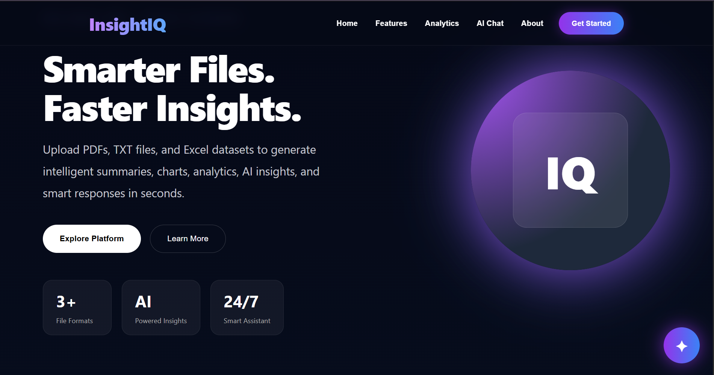
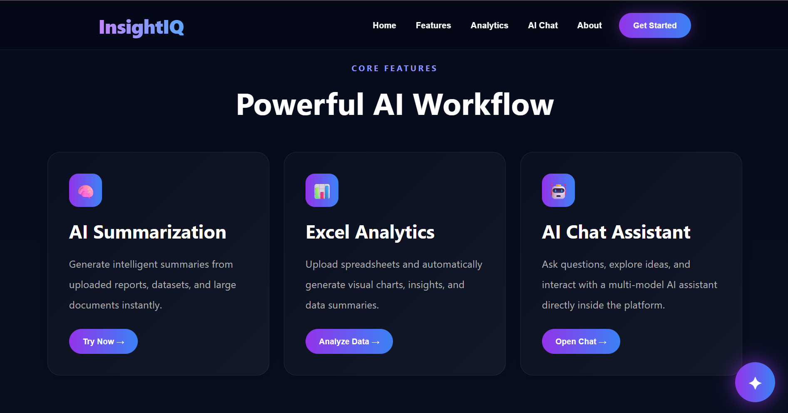
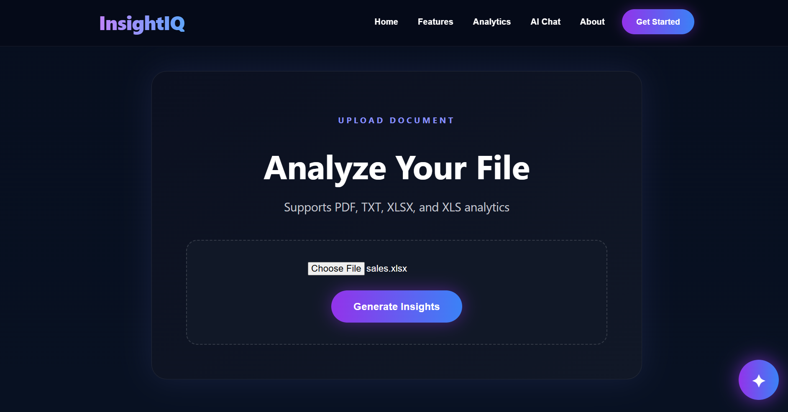
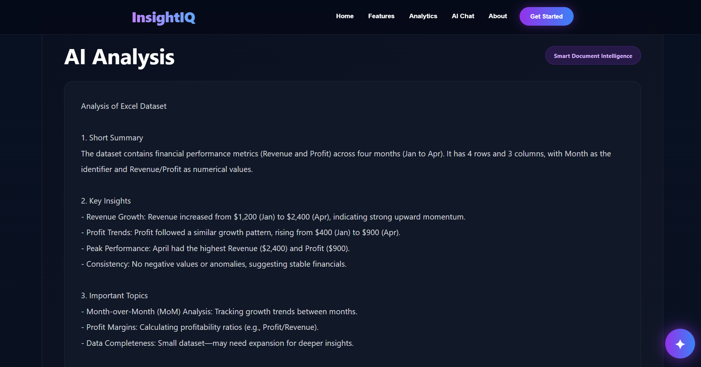
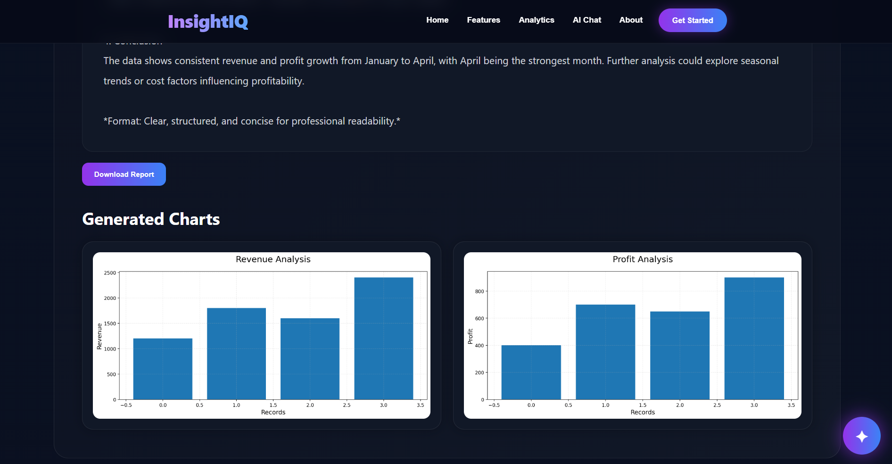
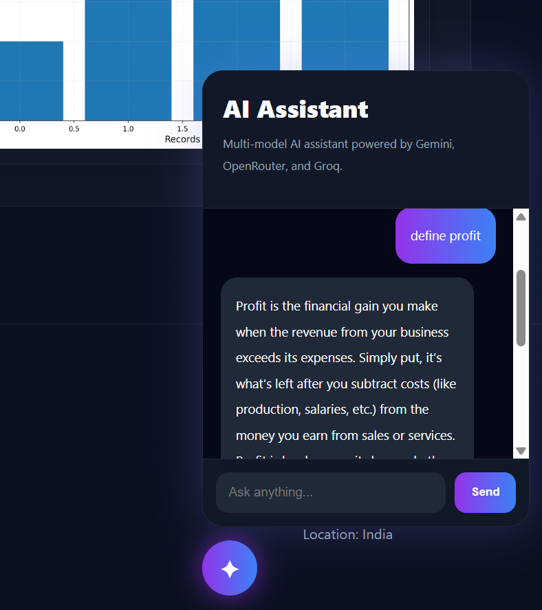

# InsightIQ

AI-powered document intelligence platform for smart analytics, summarization, AI chat, and intelligent insights.

---

## Live Demo

### Frontend
https://insight-iq-pi.vercel.app/

### Backend
https://insightiq-boi2.onrender.com

### GitHub Repository
https://github.com/Pri-30/InsightIQ

---

# Overview

InsightIQ is a modern AI-powered document intelligence platform that allows users to upload documents and instantly generate:

- AI summaries
- Smart insights
- Excel analytics
- Charts and visualizations
- AI chatbot responses
- Downloadable reports

The platform combines React, FastAPI, Pandas, Matplotlib, Gemini AI, and OpenRouter AI to create a responsive and intelligent analytics experience.

---

# Features

- AI document summarization
- Excel analytics and chart generation
- AI-powered chatbot assistant
- Smart document insights
- Dynamic data visualization
- Downloadable analysis reports
- Responsive modern UI
- Multi-model AI support

---

# Supported File Types

- PDF
- TXT
- XLSX
- XLS

---

# Tech Stack

## Frontend
- React.js
- Axios
- CSS
- Vercel Deployment

## Backend
- FastAPI
- Python
- Uvicorn

## Data Processing
- Pandas
- Matplotlib

## AI Integration
- Gemini API
- OpenRouter API
- DeepSeek Chat V3

---

# Project Architecture

```text
User Uploads File
        ↓
React Frontend
        ↓
FastAPI Backend
        ↓
Document Processing
        ↓
AI Analysis + Summarization
        ↓
Charts Generation
        ↓
Frontend Visualization
```

---

# Installation

## Clone Repository

```bash
git clone https://github.com/Pri-30/InsightIQ.git
```

---

## Frontend Setup

```bash
cd frontend
npm install
npm run dev
```

---

## Backend Setup

```bash
cd backend
pip install -r requirements.txt
uvicorn main:app --reload
```

---

# Environment Variables

Create a `.env` file inside the backend folder.

```env
GEMINI_API_KEY=your_key
OPENROUTER_API_KEY=your_key
```

---

# API Endpoints

## Upload File

```http
POST /upload
```

Uploads and analyzes files.

---

## AI Chat

```http
POST /ai-chat
```

Handles AI chatbot communication.

---

# Key Functionalities

## File Upload System
Users can upload:
- PDF files
- Text files
- Excel spreadsheets

---

## AI Summary Engine
The backend extracts document content and sends it to AI models for intelligent summarization.

---

## Excel Analytics Engine
The platform:
- Detects numeric columns
- Generates charts automatically
- Creates insights from datasets

---

## Dynamic Chart Rendering
Charts generated in Python are served through FastAPI and displayed dynamically in React.

---

# Challenges Solved

- Responsive mobile scaling issues
- Dynamic chart rendering on deployment
- Cross-origin image loading problems
- AI API quota fallback handling
- Frontend-backend deployment synchronization

---

# Future Improvements

- User authentication system
- Database integration
- OCR document scanning
- AI-generated presentations
- Advanced analytics dashboard
- Cloud storage integration
- Dark/Light mode toggle

---

# Deployment

## Frontend
Deployed on Vercel

## Backend
Deployed on Render

---

# Screenshots

## Home Page



---

## Features Section



---

## Upload Section



---

## AI Analysis



---

## Excel Analytics & Charts



---

## AI Chat Assistant



# Learning Outcomes

Through this project, the following concepts were learned and implemented:

- Full-stack web development
- React frontend development
- FastAPI backend development
- AI API integration
- File handling and processing
- Data visualization
- Deployment using Vercel and Render
- Responsive web design
- Debugging and optimization

---

# Author

## Prisha

B.Tech Student  
Full Stack & AI Enthusiast

---

# License

MIT License

---

# Acknowledgements

- Google Gemini API
- OpenRouter API
- DeepSeek AI
- React.js
- FastAPI
- Pandas
- Matplotlib
- Vercel
- Render
